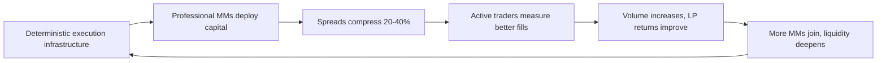
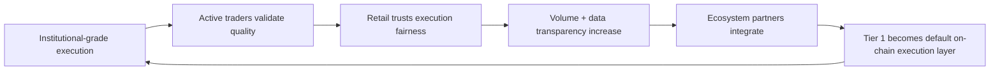

# Value Proposition

Tier 1 delivers measurable execution improvements through deterministic, low-latency infrastructure. Each participant group captures different value, but all benefit from the same structural unlock: institutional-grade liquidity on-chain.

---

## For Liquidity Providers and Market Makers

**Core value:** Deploy latency-sensitive strategies on-chain with deterministic fills and transparent queue rules—impossible on existing venues.

**Measurable benefits:**
- Sub-1ms execution latency via colocation
- Zero discretionary matching or internalization
- Verifiable on-chain audit trails for all fills
- Fee rebates tied to sustained depth and uptime

**GTM implication:** This is the supply-side unlock. Without MMs, there's no execution quality to market. BSO partnership + pilot programs are the primary acquisition levers.

**KPI tie-in:** 6+ MMs live, $15M+ depth, 99.9%+ uptime.

## For Active Traders and Power Retail

**Core value:** 20-40% tighter spreads and 30-60% lower slippage vs. competing venues, directly improving realized PnL.

**Measurable benefits:**
- <10bps spreads on BTC/ETH perps (vs. 15-25bps on CEXs)
- <15bps slippage for $50K trades (vs. 30-50bps)
- Transparent execution dashboards showing real-time fill quality
- Points programs tied to sustained volume, not wash trading

**GTM implication:** Active traders are the validation layer. If they can measure better fills, we have third-party proof for retail expansion.

**KPI tie-in:** 300+ active traders, $50M+ daily volume, 60%+ retention, 20%+ organic referrals.

## Broader Retail Traders

**Core value:** Access to HFT-grade liquidity without competing on latency—lower costs, predictable liquidations, transparent rules.

**Measurable benefits:**
- Same spreads as institutions (no two-tier pricing)
- <2% unfair liquidations (vs. 8-12% CEX average)
- Transparent on-chain execution rules
- Educational content explaining execution quality

**GTM implication:** Retail scales once execution quality is proven by active traders. Wallet integrations + referral schemes drive acquisition in months 9-12.

**KPI tie-in:** 8,000+ monthly active retail, $200M+ OI, 50%+ active beyond 90 days, NPS >40.

## For Ecosystem Partners and Infrastructure Providers

**Core value:** High-quality execution data and shared incentives tied to real user activity, not synthetic volume.

**Measurable benefits:**
- Transparent on-chain data for analytics and tooling
- APIs/SDKs for seamless integration
- Co-marketing and shared points programs

**GTM implication:** Partners amplify distribution without fragmenting liquidity. Prioritize prop platforms and execution-focused UIs.

**KPI tie-in:** 5+ integrations live by month 12, 30%+ volume via partners, 1,000+ monthly partner-driven signups.

## For the Protocol and Network

**Core value:** Trading volume directly improves execution quality—liquidity and market depth compound over time.

**Measurable benefits:**
- Every trade tightens spreads and deepens order books
- Fees and incentives align with productive activity
- Points programs verify real contribution
- Self-reinforcing liquidity flywheel

**GTM implication:** Network effects become the moat. Once liquidity crosses threshold depth, growth becomes self-sustaining.

**KPI tie-in:** Incentive efficiency ($ spent per $ of sustained liquidity), organic volume growth, incentive taper schedule adherence.

---

## Why This Matters for GTM

**For MMs:** Colocation + deterministic execution is the only way to deploy HFT strategies on-chain. This is not a "better exchange"—it's infrastructure that doesn't exist elsewhere. BSO intros are critical.

**For traders:** Execution quality is measurable. Publish real-time dashboards showing spreads, slippage, and fill quality vs. CEXs. Let traders verify improvements independently.

**For retail:** The story is simple: "HFTs provide liquidity here, they don't trade against you." Transparent liquidations + on-chain rules eliminate CEX discretion.

**For partners:** High-quality data + shared incentives align growth. Partners want execution quality they can market to their users.

**Measurement matters:** Every GTM activity ties to at least one KPI. Liquidity depth, trader retention, execution metrics, and partner-driven signups are the scoreboard.

---

## Liquidity Flywheel

---

## Adoption Flywheel

---

**So what for GTM:** Value proposition is not marketing—it's measurable execution improvements. Every phase proves value for the next. MMs unlock liquidity, traders validate quality, retail scales trust, partners amplify distribution.
