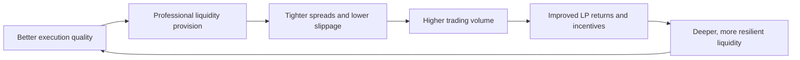
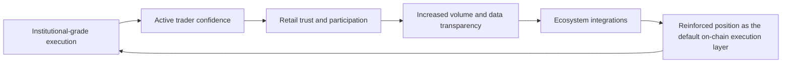

# Value Proposition

Tier 1 delivers an execution-first trading environment that combines ultra-low latency, deterministic on-chain execution, and institutional-grade liquidity. By replacing opaque centralized matching engines with transparent, verifiable execution rules, Tier 1 enables professional trading strategies on-chain while materially improving outcomes for active and retail traders.

---

## For Liquidity Providers and Market Makers

- Ultra-low-latency and deterministic execution that enables latency-sensitive strategies which do not work on existing on-chain venues
- Predictable queue positioning and execution outcomes, removing discretionary matching and internalization risk
- Deep, stable markets supported by transparent fee structures and verifiable on-chain execution
- Points-based incentives tied to real liquidity provision, uptime, and sustained participation

**Outcome:**

Consistent, scalable liquidity provision with institutional-grade execution guarantees and long-term alignment with the protocol.

---

## For Active Traders and Power Retail

- Tight spreads and reduced slippage driven by professional liquidity
- Deterministic execution that improves fill quality during volatile market conditions
- Transparent liquidation mechanics and predictable risk outcomes
- Incentives that reward real trading activity rather than short-term speculation

**Outcome:**

Improved realized PnL, higher confidence in execution, and stronger trader retention.

---

## For Broader Retail Traders

- Access to institutional-grade liquidity without needing to compete on latency
- Transparent, on-chain price discovery and execution fairness
- Clear incentive programs that reward productive participation and learning
- A market structure designed to reduce hidden costs and execution uncertainty

**Outcome:**

Fairer access to deep, liquid markets with predictable execution and lower implicit trading costs.

---

## For Ecosystem Partners and Infrastructure Providers

- High-quality, on-chain execution data suitable for analytics, risk engines, and trading tools
- Increased user activity driven by deep liquidity and superior execution quality
- Integration with a transparent, institutional-grade execution layer that enhances credibility

**Outcome:**

Sustainable ecosystem growth driven by real trading activity rather than incentive-only usage.

---

## For the Protocol and Network

- Trading volume directly improves execution quality and market depth
- Fees and incentives are aligned with productive activity and long-term liquidity
- Points and rewards evolve with network performance, reinforcing healthy growth
- Every trade strengthens the underlying execution layer

**Outcome:**

A self-reinforcing trading network where growth compounds through better execution rather than dilution.

---

## Liquidity Flywheel

---

## Adoption Flywheel

---

Tier 1's value proposition is not driven by incentives alone. It is driven by execution quality that compounds over time, creating a trading environment where every participant benefits from the same structural improvements.
